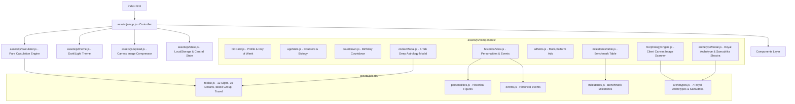

# 🏛️ Master Blueprint: Life Timeline & Historical Age Analyzer

## 1. প্রজেক্টের পরিচিতি ও রূপকল্প (Vision & Overview)
**Life Timeline & Historical Age Analyzer** হলো একটি ক্লায়েন্ট-সাইড ইন্টারঅ্যাক্টিভ ওয়েব অ্যাপ্লিকেশন। ব্যবহারকারী তার জন্মতারিখ, সময়, রক্তের গ্রুপ ও রিলেশনশিপ স্ট্যাটাস প্রদান করলে সিস্টেমটি তার সঠিক বয়স (বছর, মাস, দিন, ঘণ্টা, মিনিট, সেকেন্ড) নিরূপণ করার পাশাপাশি মহাজাগতিক দূরত্ব, হৃদস্পন্দন, শ্বাস-প্রশ্বাসের পরিসংখ্যান, দ্রেক্বাণ ও গ্রহচর সহ রাশিচক্রের বিশ্লেষণ, বায়ো-অ্যাস্ট্রো নিউট্রিশন ব্লুপ্রিন্ট, ফেসিয়াল মরফোলজি ও ৭টি রয়্যাল আর্কিটাইপ স্ক্যানার, সমসাময়িক ঐতিহাসিক পটভূমি এবং বিশ্ববরেণ্য মনীষীদের বয়সভিত্তিক কৃতিত্বের সাথে একটি অনন্য মেলবন্ধন তৈরি করে।

---

## 2. সিস্টেম আর্কিটেকচার (System Architecture)
প্রজেক্টটি **Modular ES6 Architecture** এবং **Separation of Concerns (SoC)** নীতিতে প্রতিষ্ঠিত। কোনো বান্ডলার (Webpack/Vite) ছাড়াই এটি সরাসরি আধুনিক ব্রাউজারে নেটিভ ES Modules দিয়ে চলে।



---

## 3. প্রযুক্তি ও অবকাঠামো (Tech Stack)
1. **Core Language:** HTML5, Modern ECMAScript 6+ (Vanilla JS Modules).
2. **Styling & Design System:**
   - Tailwind CSS (via CDN)
   - Custom Glassmorphism, Holographic Scanners & Animations: `assets/css/style.css`
   - Ad Optimization & Anti-CLS Rules: `assets/css/ads.css`
3. **Typography:**
   - Bengali: `Hind Siliguri` (Google Fonts)
   - Numbers & Accents: `Outfit` (Google Fonts)
4. **Backend / Server:** **ZERO Backend** (১০০% ক্লায়েন্ট-সাইড, কোনো Node.js, Express, Python বা PHP প্রয়োজন নেই)।
5. **Database:** **ZERO Database** (ব্রাউজারের `localStorage` ব্যবহার করে সম্পূর্ণ অফলাইন ও সুরক্ষিত)।
6. **Privacy & Security:** ছবি বা বায়োমেট্রিক ডেটা কোনো দূরবর্তী সার্ভারে আপলোড হয় না; ক্লায়েন্ট ক্যানভাসে প্রসেস হয়।
7. **Hosting / Deployment:** GitHub Pages (Root directory `/`).

---

## 4. প্রধান ফিচার ও কার্যপরিধি (Scope & Feature Breakdown)

### ক. প্রিফেক্ট এজ ও টাইম ক্যালকুলেটর (Precision Engine)
- **ফাংশন:** `calculateExactAge(birthDate, targetDate)`
- **ফিচার:**
  - বছর, মাস ও দিনের নিখুঁত হিসাব।
  - মোট দিন, মোট সপ্তাহ, মোট ঘণ্টা, মোট মিনিট এবং লাইভ টিকিং সেকেন্ড।
  - ইউজার বায়ো কার্ডে স্বয়ংক্রিয়ভাবে নির্ণীত **প্রমিনেন্ট জন্মবার (Day of the Week)** ব্যাজ।

### খ. বায়োলজিক্যাল ও মহাজাগতিক পরিসংখ্যান (Cosmic & Biology Stats)
- **ফাংশন:** `updateAgeStats(birthDate)`
- **ফিচার:**
  - **অতিক্রান্ত মহাজাগতিক দূরত্ব:** পৃথিবী সূর্যের চারদিকে প্রদক্ষিণের গড় গতিতে ভ্রমণকৃত মোট দূরত্ব (কিমি)।
  - **আনুমানিক হৃদস্পন্দন ও শ্বাস-প্রশ্বাস:** মোট জীবদ্দশার স্পন্দন ও শ্বাস গ্রহণ।
  - **ঘুমের সময়কাল:** মোট জীবদ্দশার আনুমানিক ১/৩ অংশ ঘুমের বছর।

### গ. অ্যাডভান্সড জোডিয়াক ও অ্যাস্ট্রোলজি ইন্টেলিজেন্স (Deep Zodiac Engine)
- **মডিউল:** `assets/js/components/zodiacModal.js`, `assets/js/data/zodiac.js`
- **ফিচার:**
  - **৩৬টি দ্রেক্বাণ (Decanates):** প্রতিটি রাশির ১০° উপ-বিভাগ ও উপ-শাসক গ্রহ (Sub-planet) অ্যানালাইসিস।
  - **বিদেশ ভ্রমণ ও আন্তর্জাতিক ভাগ্য সূচক (Foreign Travel Index):** চর/স্থির/দ্বৈত রাশি ও ৯ম-১২শ ভাব ভিত্তিক ০-১০০% স্কোর ও অনুকূল দেশ।
  - **বারভিত্তিক শাসক গ্রহ ও গোল্ডেন আওয়ার (Cosmic Day Ruler & Golden Hours):** জন্মবারের মহাজাগতিক সংযোগ ও দৈনিক শুভ সময়।
  - **পার্টনার কম্প্যাটিবিলিটি সিমুলেটর:** ১২টি রাশির সাথে উপাদানগত (Fire, Earth, Air, Water) রসায়ন ও সতর্কতা।
  - **রিলেশনশিপ স্ট্যাটাস গাইড:** সিঙ্গেল, প্রেম, বিবাহিত ইত্যাদির জন্য নির্দিষ্ট উপদেশ।

### ঘ. বায়ো-অ্যাস্ট্রো হেলথ ও নিউট্রিশন ব্লুপ্রিন্ট (Ketsueki-gata Blueprint)
- **ফিচার:**
  - রক্তের গ্রুপ (`A+`, `A-`, `B+`, `B-`, `O+`, `O-`, `AB+`, `AB-`) ইনপুট।
  - জাপানি কেতসুয়েকি-গাতা ও আয়ুর্বেদিক এলিমেন্টাল মেটাবলিজম ও ডায়েট গাইড।
  - রাশিভিত্তিক অঙ্গ-প্রত্যঙ্গের সংবেদনশীলতা ও প্রতিরোধমূলক যত্ন।

### ঙ. অ্যাস্ট্রো-মরফোলজি ও রয়্যাল আর্কিটাইপ স্ক্যানার (Astro-Morphology & Royal Archetype)
- **মডিউল:** `assets/js/components/archetypeModal.js`, `assets/js/components/morphologyEngine.js`, `assets/js/data/archetypes.js`
- **ফিচার:**
  - **১০০% ক্লায়েন্ট-সাইড ক্যানভাস পিক্সেল স্ক্যানার:** আপলোড করা ছবির কালার হিস্টোগ্রাম ও ভাইব্রেন্সি বিশ্লেষণ।
  - **৭টি রাজকীয় আর্কিটাইপ:**
    1. 👑 সম্রাট / অধিপতি (The Sovereign)
    2. ⚔️ অপরাজেয় সেনাপতি (The Commander)
    3. 🔮 রহস্যময় দ্রষ্টা / দার্শনিক (The Mystic Sage)
    4. 🎨 যুগান্তকারী রূপকার (The Visionary Creator)
    5. 🎭 সম্মোহনী দূত (The Charismatic Diplomat)
    6. ♟️ মহাজাগতিক কুশলী (The Master Strategist)
    7. 🛡️ মহিমান্বিত রক্ষক (The Noble Guardian)
  - **৬টি ডাইমেনশনাল মেট্রিক বার:** নেতৃত্ব, সৃজনশীলতা, আধ্যাত্মিকতা, বাচনভঙ্গি, ইচ্ছাশক্তি, দূরদর্শিতা।
  - **সামুদ্রিক লক্ষণ বিচার (Samudrika Shastra):** মুখের গড়ন, চোখের অরা, কপালের প্রজ্ঞা প্যালেস।
  - **লাইভ ম্যানুয়াল টিউনিং মোড:** ড্রপডাউন পরিবর্তন করে লাইভ মেট্রিক আপডেট।
  - **রয়্যাল কার্ড কপি:** এক ক্লিকে দৃষ্টিনন্দন রয়্যাল আর্কিটাইপ কার্ড ক্লিপবোর্ডে কপি।

### চ. ঐতিহাসিক মেলবন্ধন ও মাইলস্টোন বেঞ্চমার্ক
- একই দিনে জন্ম নেওয়া ৩ জন মনীষীর প্রোফাইল ও ক্যালেন্ডার ইভেন্ট।
- মনীষীদের বয়সের সাথে অর্জিত ও আসন্ন মাইলস্টোন ছক (ফিল্টার সহ)।

---

## 5. ডেটা কন্ট্রাক্ট ও স্কিমা (Data Contracts)

### ১. Profile State Schema (`state.js`)
```typescript
interface UserProfile {
  day: number;          // 1 - 31
  month: number;        // 1 - 12
  year: number;         // e.g. 1998
  country: string;      // 'BD' | 'IN' | 'GLOBAL'
  name: string;         // User full name
  gender: string;       // 'male' | 'female' | 'other'
  relationship: string; // 'single' | 'relationship' | 'married' | 'living_together' | 'divorced' | 'widowed'
  bloodGroup: string;   // 'A+' | 'A-' | 'B+' | 'B-' | 'O+' | 'O-' | 'AB+' | 'AB-' | 'unknown'
  time: string;         // 'HH:MM'
  avatar: string;       // Base64 JPEG data URL or empty
}
```

### ২. Archetype Profile Schema (`morphologyEngine.js`)
```typescript
interface ArchetypeProfile {
  primaryArchetype: ArchetypeDefinition;
  secondaryArchetype: ArchetypeDefinition;
  metrics: {
    leadership: number;    // 0 - 100
    creativity: number;    // 0 - 100
    spirituality: number;  // 0 - 100
    magnetism: number;     // 0 - 100
    willpower: number;     // 0 - 100
    wisdom: number;        // 0 - 100
  };
  samudrika: {
    faceShape: FeatureDetail;
    eyeAura: FeatureDetail;
    forehead: FeatureDetail;
  };
}
```
