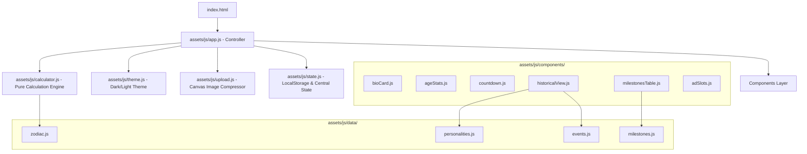

# 🏛️ Master Blueprint: Life Timeline & Historical Age Analyzer

## 1. প্রজেক্টের পরিচিতি ও রূপকল্প (Vision & Overview)
**Life Timeline & Historical Age Analyzer** হলো একটি ক্লায়েন্ট-সাইড ইন্টারঅ্যাক্টিভ ওয়েব অ্যাপ্লিকেশন। ব্যবহারকারী তার জন্মতারিখ ও সময় প্রদান করলে সিস্টেমটি তার সঠিক বয়স (বছর, মাস, দিন, ঘণ্টা, মিনিট, সেকেন্ড) নিরূপণ করার পাশাপাশি মহাজাগতিক দূরত্ব, হৃদস্পন্দন, শ্বাস-প্রশ্বাসের পরিসংখ্যান, জ্যোতির্বিজ্ঞান (রাশিচক্র), সমসাময়িক ঐতিহাসিক পটভূমি এবং বিশ্ববরেণ্য মনীষীদের বয়সভিত্তিক কৃতিত্বের সাথে একটি মেলবন্ধন তৈরি করে।

---

## 2. সিস্টেম আর্কিটেকচার (System Architecture)
প্রজেক্টটি **Modular ES6 Architecture** এবং **Separation of Concerns (SoC)** নীতিতে প্রতিষ্ঠিত। কোনো বান্ডলার (Webpack/Vite) ছাড়াই এটি সরাসরি আধুনিক ব্রাউজারে নেটিভ ES Modules দিয়ে চলে।



---

## 3. প্রযুক্তি ও অবকাঠামো (Tech Stack)
1. **Core Language:** HTML5, Modern ECMAScript 6+ (Vanilla JS Modules).
2. **Styling & Design System:**
   - Tailwind CSS (via CDN)
   - Custom Glassmorphism & Animations: `assets/css/style.css`
   - Ad Optimization & Anti-CLS Rules: `assets/css/ads.css`
3. **Typography:**
   - Bengali: `Hind Siliguri` (Google Fonts)
   - Numbers & Accents: `Outfit` (Google Fonts)
4. **Backend / Server:** **ZERO Backend** (১০০% ক্লায়েন্ট-সাইড, কোনো Node.js, Express, Python বা PHP প্রয়োজন নেই)।
5. **Database:** **ZERO Database** (ব্রাউজারের `localStorage` ব্যবহার করে সম্পূর্ণ অফলাইন ও সুরক্ষিত)।
6. **Hosting / Deployment:** GitHub Pages (Root directory `/`).

---

## 4. প্রধান ফিচার ও কার্যপরিধি (Scope & Feature Breakdown)

### ক. প্রিফেক্ট এজ ও টাইম ক্যালকুলেটর (Precision Engine)
- **ফাংশন:** `calculateExactAge(birthDate, targetDate)`
- **ফিচার:**
  - বছর, মাস ও দিনের নিখুঁত হিসাব (দিন বা মাসের ঋণাত্মক মান যথাযথভাবে সমন্বিত)।
  - মোট দিন, মোট সপ্তাহ, মোট ঘণ্টা, মোট মিনিট এবং মোট সেকেন্ড।
  - জীবন্ত টিকিং ক্লক (Live Second-by-second ticker)।

### খ. বায়োলজিক্যাল ও মহাজাগতিক পরিসংখ্যান (Cosmic & Biology Stats)
- **ফাংশন:** `updateAgeStats(birthDate)`
- **ফিচার:**
  - **অতিক্রান্ত মহাজাগতিক দূরত্ব:** পৃথিবী সূর্যের চারদিকে প্রদক্ষিণের গড় গতিতে (বছরে প্রায় ৯৪ কোটি কিমি) মোট ভ্রমণ করা দূরত্ব।
  - **আনুমানিক হৃদস্পন্দন:** প্রতি মিনিটে গড়ে ৭৫ বিট হিসেবে মোট স্পন্দন (বিলিয়ন+ ফরম্যাটিং সহ)।
  - **মোট শ্বাস-প্রশ্বাস:** প্রতি মিনিটে গড়ে ১৬টি শ্বাস হিসেবে মোট শ্বাস গ্রহণ।
  - **ঘুমের সময়কাল:** মোট জীবদ্দশার আনুমানিক ১/৩ অংশ ঘুমের বছর।

### গ. পরবর্তী জন্মদিন ও রাশিচক্র (Countdown & Zodiac Engine)
- **ফাংশন:** `calculateNextBirthday(birthDate)`, `renderZodiacCard(month, day)`
- **ফিচার:**
  - পরবর্তী জন্মদিন আসতে ঠিক কত দিন, ঘণ্টা, মিনিট ও সেকেন্ড বাকি তা লাইভ কাউন্টডাউন।
  - ১২টি রাশিচক্রের প্রতীক, বাংলা নাম, উপাদান (অগ্নি, জল, বায়ু, পৃথিবী), শাসক গ্রহ এবং চারিত্রিক বৈশিষ্ট্যের বিশ্লেষণ।

### ঘ. ঐতিহাসিক মেলবন্ধন (Historical Insights)
- **ফাংশন:** `renderHistoricalInsights(month, day, year)`
- **ফিচার:**
  - **একই দিনে জন্ম নেওয়া মনীষী:** ব্যবহারকারীর জন্মতারিখে জন্ম নেওয়া ৩ জন বিশ্ববরেণ্য মনীষীর ছবি, পরিচিতি ও জীবনকাল প্রদর্শন।
  - **ক্যালেন্ডার মেলবন্ধন:** ওই নির্দিষ্ট দিনে ইতিহাসে ঘটে যাওয়া প্রধান বৈশ্বিক ঘটনা।
  - **জন্মকালের বিশ্ব পটভূমি:** ব্যবহারকারীর জন্মের দশক বা যুগের প্রেক্ষাপট (যেমন: ১৯৭১ এর মুক্তিযুদ্ধ, ৮০-এর দশকের ডিজিটাল বিপ্লব, ২০০০-এর ইন্টারনেট যুগ)।

### ঙ. মাইলস্টোন বেঞ্চমার্ক ও ফিল্টারিং (Milestones Engine)
- **ফাংশন:** `renderBenchmarkTable(userAgeYears, filterNearOnly)`
- **ফিচার:**
  - ইতিহাসের শ্রেষ্ঠ মনীষীরা কোন বয়সে কী অর্জন করেছিলেন তার তুলনামূলক তালিকা।
  - ব্যবহারকারীর বর্তমান বয়স পার হয়ে যাওয়া মাইলস্টোনগুলোতে `✓ অর্জিত বয়স` এবং ভবিষ্যতেরগুলোতে `⏳ আসন্ন মাইলফলক` ব্যাজ।
  - `সব মাইলস্টোন` এবং `কাছাকাছি বয়সের মাইলফলক` (±৭ বছর) ফিল্টার টগল।

### চ. প্রোফাইল ও অটো-অপ্টিমাইজড অ্যাভাটার (Avatar Engine)
- **মডিউল:** `assets/js/upload.js`
- **ফিচার:**
  - ড্র্যাগ-অ্যান্ড-ড্রপ অথবা ক্লিক করে ছবি আপলোড।
  - ব্রাউজার ক্যানভাসে স্বয়ংক্রিয় রিসাইজ ও কম্প্রেশন (সর্বোচ্চ ২৫৬×২৫৬ পিক্সেল, JPEG গুণমান ০.৮৫)।
  - ব্রাউজারের `localStorage` কোটা রক্ষা করে দ্রুত লোডিং নিশ্চিতকরণ।
  - ছবি মুছে ফেলার বা পরিবর্তন করার সুবিধা।

### ছ. বিজ্ঞাপন মনিটাইজেশন সিস্টেম (Multi-Platform Ad Units)
- **মডিউল:** `assets/js/components/adSlots.js`, `assets/css/ads.css`
- **ফিচার:**
  - গুগল অ্যাডসেন্স (Google AdSense), Media.net বা অন্যান্য নেটওয়ার্কের জন্য ৩টি ডেডিকেটেড স্লট (Header 728x90, In-Content 300x250, Footer 728x90)।
  - **Zero CLS (Cumulative Layout Shift):** অ্যাড লোড হওয়ার আগে নির্দিষ্ট উচ্চতা ও পলিসি-সম্মত লেবেল ধরে রাখে যাতে পেজ লাফিয়ে না ওঠে।
  - প্রিন্ট মোডে স্বয়ংক্রিয়ভাবে বিজ্ঞাপন হাইড হয়ে যায় (`no-print` ক্লাস)।

### জ. সোশ্যাল শেয়ার ও পিডিএফ এক্সপোর্ট
- **ক্লিপবোর্ড কপি:** ব্যবহারকারীর বয়সের সম্পূর্ণ সারাংশ এবং তথ্য ইমোজিসহ এক ক্লিকে কপি করার সুবিধা।
- **পিডিএফ/প্রিন্ট ভিউ:** বিশেষ প্রিন্ট স্টাইলশিট সহ পেজকে পরিষ্কার কার্ড আকারে মুদ্রণ বা সংরক্ষণ করার ব্যবস্থা।

---

## 5. ডেটা কন্ট্রাক্ট ও স্কিমা (Data Contracts)

### ১. Profile State Schema (`state.js`)
```typescript
interface UserProfile {
  day: number;          // 1 - 31
  month: number;        // 1 - 12
  year: number;         // e.g. 1998
  country: string;      // 'BD' | 'IN' | 'OTHER'
  name: string;         // User full name
  gender: string;       // 'male' | 'female' | 'other'
  time: string;         // 'HH:MM'
  avatar: string;       // Base64 JPEG data URL or empty
}
```

### ২. Age Calculation Output Schema (`calculator.js`)
```typescript
interface AgeResult {
  years: number;
  months: number;
  days: number;
  totalSeconds: number;
  totalMinutes: number;
  totalHours: number;
  totalDays: number;
  totalWeeks: number;
}
```

### ৩. Personality Data Schema (`personalities.js`)
```typescript
interface Personality {
  name: string;
  year: number;
  month: number;        // 1 - 12
  day: number;          // 1 - 31
  title: string;
  bio: string;
  avatar: string;       // Unsplash optimized image URL
}
```
