# 🏛️ Master Blueprint: Life Timeline & Historical Age Analyzer

## 1. প্রজেক্টের পরিচিতি ও রূপকল্প (Vision & Overview)
**Life Timeline & Historical Age Analyzer** হলো একটি অত্যন্ত আধুনিক, দ্রুতগতির এবং ক্লায়েন্ট-সাইড ইন্টারঅ্যাক্টিভ ওয়েব অ্যাপ্লিকেশন। ব্যবহারকারী তার জন্মতারিখ দিলে সিস্টেমটি প্রগ্রেসিভ ৩-ধাপের ডিসক্লোজার (Progressive Disclosure) পদ্ধতির মাধ্যমে তার সঠিক বয়স, মহাজাগতিক পরিভ্রমণ, ঐতিহাসিক মেলবন্ধন, গভীর রাশিচক্র, বায়োমেট্রিক ফেসিয়াল লেজার স্ক্যানিং এবং ৭টি রয়্যাল আর্কিটাইপ ব্লুপ্রিন্ট উন্মোচন করে। সম্পূর্ণ প্রজেক্টটি ডুয়েল ল্যাঙ্গুয়েজ (বাংলা ও ইংরেজি) সাপোর্টেড এবং ভাইরাল সোশ্যাল মিডিয়া স্টোরি জেনারেটর সমৃদ্ধ।

---

## 2. সিস্টেম আর্কিটেকচার (System Architecture)
প্রজেক্টটি **Modular ES6 Architecture** এবং **Separation of Concerns (SoC)** নীতিতে প্রতিষ্ঠিত। কোনো ভারী ফ্রেমওয়ার্ক বা বান্ডলার ছাড়াই এটি ব্রাউজারের নেটিভ ES Modules ব্যবহার করে চলে।

```mermaid
graph TD
    A[index.html] --> B[assets/js/app.js - Controller]
    B --> C[assets/js/theme.js - Dark/Light Theme]
    B --> D[assets/js/i18n.js - Dual Language Engine]
    B --> E[assets/js/state.js - LocalStorage & Central State]
    B --> F[assets/js/calculator.js - Pure Calculation Engine]
    B --> G[Components Layer]
    
    subgraph Components [assets/js/components/]
        G0[completionMeter.js - 35% / 70% / 100% Tracker]
        G1[bioCard.js - Profile & Day of Week]
        G2[ageStats.js - Counters & Cosmic Biology]
        G3[countdown.js - Birthday Countdown]
        G4[historicalModal.js - Card 1 Personalities & Events]
        G5[milestonesModal.js - Card 2 Benchmark Milestones]
        G6[zodiacModal.js - Card 3 Deep Astro & Intake Modal]
        G7[morphologyEngine.js - Client Canvas Image Scanner]
        G8[archetypeModal.js - Card 4 Biometric Laser Scanner & Dashboard]
        G9[socialStory.js - 9:16 Canvas Story Generator]
        G10[adSlots.js - Multi-platform Ads]
    end

    subgraph Data [assets/js/data/]
        D1[locales.js - BN & EN Translations]
        F1[zodiac.js - 12 Signs, 36 Decans, Blood Group, Travel]
        F2[personalities.js - Historical Figures]
        F3[events.js - Historical Events]
        F4[milestones.js - Benchmark Milestones]
        F5[archetypes.js - 7 Royal Archetypes & Samudrika]
    end

    D --> D1
    F --> F1
    G4 --> F2
    G4 --> F3
    G5 --> F4
    G6 --> F1
    G7 --> F5
    G8 --> F5
```

---

## 3. প্রযুক্তি ও অবকাঠামো (Tech Stack)
1. **Core Language:** HTML5, Modern ECMAScript 6+ (Vanilla JS Modules).
2. **Styling & Design System:**
   - Tailwind CSS (via CDN)
   - Custom Glassmorphism, Biometric Laser Scanners, Progress HUD & Animations: `assets/css/style.css`
   - Ad Optimization & Anti-CLS Rules: `assets/css/ads.css`
3. **Typography:**
   - Bengali: `Hind Siliguri` (Google Fonts)
   - Numbers & Accents: `Outfit` (Google Fonts)
4. **Backend / Server:** **ZERO Backend** (১০০% ক্লায়েন্ট-সাইড অফলাইন-রেডি অ্যাপ্লিকেশন)।
5. **Database:** **ZERO Database** (ব্রাউজারের `localStorage` ব্যবহার করে সম্পূর্ণ অফলাইন ও সুরক্ষিত)।
6. **Privacy & Security:** ছবি বা বায়োমেট্রিক ডেটা কোনো দূরবর্তী সার্ভারে পাঠানো হয় না; ব্রাউজার ক্যানভাসে নিরাপদভাবে প্রসেস হয়।
7. **Hosting / Deployment:** GitHub Pages (Root directory `/`).

---

## 4. প্রধান ফিচার ও কার্যপরিধি (Scope & Feature Breakdown)

### ক. প্রগ্রেসিভ ৩-ধাপের ডিসক্লোজার (3-Stage Workflow)
- **ধাপ ১ (জিরো ফ্রিকশন কোর বয়স):** শুধুমাত্র দিন, মাস ও বছর ইনপুট নিয়ে তাৎক্ষণিক বয়স, মহাজাগতিক ভ্রমণ ও পরবর্তী জন্মদিনের টাইমার প্রদর্শন (৩৫% প্রোগ্রেস)।
- **ধাপ ২ (অ্যাস্ট্রো ইন্টেলিজেন্স আনলক):** রাশিচক্র কার্ড ৩ বা গ্যামিফিকেশন ব্যাজে ক্লিক করে লিঙ্গ, দেশ, জন্মসময়, রক্তের গ্রুপ প্রদান করলে গভীর ৭-ট্যাব রাশিফল উন্মুক্ত হয় (৭০% প্রোগ্রেস)।
- **ধাপ ৩ (বায়োমেট্রিক আর্কিটাইপ আনলক):** কার্ড ৪-এ ক্লিক করে ছবি আপলোড এবং লাইভ হলোগ্রাফিক লেজার স্ক্যানিংয়ের মাধ্যমে শতভাগ প্রোফাইল আনলক হয় (১০০% প্রোগ্রেস)।

### খ. বায়োমেট্রিক ফটো আপলোড ইনটেক ও লেজার স্ক্যানিং
- ড্র্যাগ অ্যান্ড ড্রপ ও ফাইল ব্রাউজ জোন।
- ছবির উপর জীবন্ত সোনালী/অ্যাম্বার লেজার স্ক্যান লাইন সুইপ অ্যানিমেশন (`scanner-laser-line`)।
- ৪-ধাপের রিয়েল-টাইম প্রোগ্রেস লগ (পিক্সেল অ্যানালাইসিস ➜ সামুদ্রিক পরিমাপ ➜ ৭ আর্কিটাইপ ম্যাপিং ➜ সম্পন্ন)।
- ৭টি রাজকীয় আর্কিটাইপ ও ৬টি ডাইমেনশনাল মেট্রিক বার (নেতৃত্ব, সৃজনশীলতা, আধ্যাত্মিকতা, বাচনভঙ্গি, ইচ্ছাশক্তি, দূরদর্শিতা)।

### গ. আন্তর্জাতিক ডুয়েল ল্যাঙ্গুয়েজ ইঞ্জিন (Dual-Language i18n)
- বাংলা 🇧🇩 এবং English 🇬🇧 এর মধ্যে তাৎক্ষণিক টগল।
- সমস্ত সংখ্যা, তারিখ ও চার্ট ভ্যালু স্বয়ংক্রিয়ভাবে সংশ্লিষ্ট লিপিতে রূপান্তর (`০-৯` বনাম `0-9`)।

### ঘ. ভাইরাল সোশ্যাল স্টোরি কার্ড জেনারেটর
- Instagram, Facebook ও WhatsApp স্টোরির উপযোগী ৯:১৬ উল্লম্ব ফরম্যাটে ক্যানভাস ভিত্তিক ইমেজ এক্সপোর্ট।
- এক ক্লিকে হাই-রেজোলিউশন পিএনজি (PNG) ডাউনলোড।

---

## 5. গিট ও ব্রাঞ্চিং পলিসি (Git Guidelines)
- `main` ব্রাঞ্চ সর্বদা প্রোডাকশন-রেডি থাকবে।
- নতুন কোনো এক্সপেরিমেন্ট বা পরিবর্তন আইসোলেটেড ফিচার ব্রাঞ্চে (যেমন: `feature/progressive-ux-i18n`) সম্পন্ন হবে।
- প্রতিটি কাজের শেষে ডকুমেন্টেশন সিংক ও পরিষ্কার কমিট মেসেজ নিশ্চিত করা বাধ্যতামূলক।
