# 🏛️ Master Blueprint: Life Timeline & Historical Age Analyzer

## 1. প্রজেক্টের পরিচিতি ও রূপকল্প (Vision & Overview)
**Life Timeline & Historical Age Analyzer** হলো একটি অত্যন্ত আধুনিক, দ্রুতগতির এবং ক্লায়েন্ট-সাইড ইন্টারঅ্যাক্টিভ ওয়েব অ্যাপ্লিকেশন। ব্যবহারকারী তার জন্মতারিখ দিলে সিস্টেমটি প্রগ্রেসিভ মাল্টি-স্টেজ ডিসক্লোজার (Progressive Disclosure) পদ্ধতির মাধ্যমে তার সঠিক বয়স, মহাজাগতিক পরিভ্রমণ, ঐতিহাসিক মেলবন্ধন, গভীর রাশিচক্র, বায়োমেট্রিক ফেসিয়াল আর্কিটাইপ এবং সর্বাধুনিক **এআই পামিস্ট্রি ও অ্যাস্ট্রো-পামার কসমিক ফিউশন** উন্মোচন করে। সম্পূর্ণ প্রজেক্টটি ডুয়েল ল্যাঙ্গুয়েজ (বাংলা ও ইংরেজি) সাপোর্টেড এবং হাই-রেজোলিউশন ক্যানভাস এক্সপোর্টার সমৃদ্ধ।

---

## 2. সিস্টেম আর্কিটেকচার (System Architecture)
প্রজেক্টটি **Modular ES6 Architecture** এবং **Separation of Concerns (SoC)** নীতিতে প্রতিষ্ঠিত। কোনো ভারী ফ্রেমওয়ার্ক বা বান্ডলার ছাড়াই এটি ব্রাউজারের নেটিভ ES Modules ব্যবহার করে চলে।

```mermaid
graph TD
    A[index.html] --> B[assets/js/app.js - Controller]
    B --> C[assets/js/theme.js - Dark/Light Theme]
    B --> D[assets/js/i18n.js - Dual Language Engine]
    B --> E[assets/js/state.js - LocalStorage & Central State]
    B --> F[assets/js/calculator.js - Pure Calculation Engine]
    B --> H[assets/js/upload.js - Photo Processing & Memory Reset]
    B --> G[Components Layer]
    
    subgraph Components [assets/js/components/]
        G0[completionMeter.js - Progress Tracker]
        G1[bioCard.js - Profile & Day of Week]
        G2[ageStats.js - Counters & Cosmic Biology]
        G3[countdown.js - Birthday Countdown]
        G4[historicalModal.js - Card 1 Personalities & Events]
        G5[milestonesModal.js - Card 2 Benchmark Milestones]
        G6[zodiacModal.js - Card 3 Deep Astro & Intake Modal]
        G7[morphologyEngine.js - Client Canvas Image Scanner]
        G8[archetypeModal.js - Card 4 Biometric Laser Scanner]
        G9[palmistryEngine.js - Computer Vision, 2D:4D & AR Splines]
        G10[palmistryModal.js - 5-Tab Palmistry & Cosmic Fusion]
        G11[modalManager.js - Dynamic Modal & Scroll Lock Manager]
        G12[socialStory.js - 9:16 Canvas Story Generator]
        G13[adSlots.js - Multi-platform Ads]
    end

    subgraph Data [assets/js/data/]
        D1[locales.js - BN & EN Translations]
        F1[zodiac.js - 12 Signs, 36 Decans, Blood Group, Travel]
        F2[personalities.js - Historical Figures]
        F3[events.js - Historical Events]
        F4[milestones.js - Benchmark Milestones]
        F5[archetypes.js - 7 Royal Archetypes & Samudrika]
        F6[palmistry.js - 4 Hand Types, 7 Mounts, 2D:4D, Cosmic Synergy]
    end

    D --> D1
    F --> F1
    G4 --> F2
    G4 --> F3
    G5 --> F4
    G6 --> F1
    G7 --> F5
    G8 --> F5
    G9 --> F6
    G10 --> F6
```

---

## 3. প্রযুক্তি ও অবকাঠামো (Tech Stack)
1. **Core Language:** HTML5, Modern ECMAScript 6+ (Vanilla JS Modules).
2. **Styling & Design System:**
   - Tailwind CSS (via CDN)
   - Custom Glassmorphism, Biometric Laser Scanners, AR Palmistry Splines, Progress HUD & Animations: `assets/css/style.css`
   - Ad Optimization & Anti-CLS Rules: `assets/css/ads.css`
3. **Typography:**
   - Bengali: `Hind Siliguri` (Google Fonts)
   - Numbers & Accents: `Outfit` (Google Fonts)
4. **Backend / Server:** **ZERO Backend** (১০০% ক্লায়েন্ট-সাইড অফলাইন-রেডি অ্যাপ্লিকেশন)।
5. **Database / Storage:** **ZERO Database** (ব্রাউজারের `localStorage` ব্যবহার করে সম্পূর্ণ অফলাইন ও সুরক্ষিত)।
6. **Privacy & Security:** ছবি বা বায়োমেট্রিক ডেটা কোনো দূরবর্তী সার্ভারে পাঠানো হয় না; ব্রাউজার ক্যানভাসে সুরক্ষিতভাবে প্রসেস হয়।
7. **Hosting / Deployment:** GitHub Pages (Root directory `/`).

---

## 4. প্রধান ফিচার ও কার্যপরিধি (Scope & Feature Breakdown)

### ক. প্রগ্রেসিভ ডিসক্লোজার জার্নি (Multi-Stage Workflow)
- **ধাপ ১ (কোর বয়স ও মহাজাগতিক স্ট্যাটস):** শুধুমাত্র দিন, মাস ও বছর ইনপুট নিয়ে তাৎক্ষণিক বয়স, মহাজাগতিক ভ্রমণ, পরবর্তী জন্মদিনের টাইমার ও জন্মবার প্রদর্শন।
- **ধাপ ২ (অ্যাস্ট্রো ইন্টেলিজেন্স):** রাশিচক্র কার্ড বা ব্যাজে ক্লিক করে লিঙ্গ, দেশ, জন্মসময়, রক্তের গ্রুপ প্রদান করলে গভীর ৭-ট্যাব রাশিফল উন্মুক্ত হয়।
- **ধাপ ৩ (বায়োমেট্রিক আর্কিটাইপ):** ফেসিয়াল ড্রপজোনে ছবি আপলোড করে হলোগ্রাফিক লেজার স্ক্যানিংয়ের মাধ্যমে ৭টি রয়্যাল আর্কিটাইপ ও সামুদ্রিক ব্লুপ্রিন্ট আনলক হয়।
- **ধাপ ৪ (AI পামিস্ট্রি ও অ্যাস্ট্রো-পামার কসমিক ফিউশন):** হাতের ছবি আপলোড করে ৫-ট্যাব প্যানোরামিক পামিস্ট্রি ড্যাশবোর্ডে রেখা ট্রেসিং, মাউন্ট অ্যানালাইসিস, ২D:৪D অনুপাত ও লাইফ-টাইমলাইন পর্যবেক্ষণ।

### খ. AI পামিস্ট্রি ও চিরোম্যান্সি সিস্টেম (AI Palmistry Engine)
- **কম্পিউটার ভিশন স্কিন অ্যানালাইসিস:** অফস্ক্রিন ক্যানভাসে স্কিন কনট্যুর এক্সট্রাকশন ও পাম বাউন্ডারি ডিটেকশন।
- **এআর লাইন স্প্লাইন ট্রেসিং:** কিউবিক বেজিয়ার কার্ভের সাহায্যে জীবন রেখা, শিরোরেখা, হৃদয় রেখা, ভাগ্য রেখা ও সূর্য রেখা লাইভ ট্রেসিং।
- **লাইফ-টাইমলাইন ডায়নামিক এজ মার্কার:** ব্যবহারকারীর সঠিক বয়স অনুযায়ী জীবন রেখার ওপর ডায়নামিক গোল্ডেন মার্কার পিন ($B(t)$) স্থাপন ও তাৎক্ষণিক যুগভিত্তিক মাইলস্টোন প্রেডিকশন।
- **২D:৪D ডিজিট রেশিও বায়োমেট্রিক্স:** তর্জনী ও অনামিকার অনুপাত থেকে স্বভাবজাত গুণাগুণ ও ঝুঁকি গ্রহণের ক্ষমতা পরিমাপ।
- **দ্বৈত কর্মফল ম্যাট্রিক্স:** বাম হাত (জন্মগত সম্ভাবনা / প্রারব্ধ) বনাম ডান হাত (বর্তমান কর্মফল / ক্রিয়াশীল শক্তি)।

### গ. অ্যাস্ট্রো-পামার কসমিক ফিউশন (Astro-Palmar Cosmic Fusion)
- **রাশি ও গ্রহীয় পর্বত সিনার্জি:** রাশিচক্রের অধিপতি গ্রহের সাথে হাতের নির্দিষ্ট পর্বতের (যেমন: সিংহ $\to$ রবির পর্বত, ধনু/মীন $\to$ বৃহস্পতির পর্বত) এনার্জি ফ্লো গণনা।
- **ব্লাড গ্রুপ ও আয়ুর্বেদিক দোষা সংযোগ:** রক্তের গ্রুপ (O, A, B, AB) অনুযায়ী আয়ুর্বেদিক দোষা (বাত, পিত্ত, কফ) এবং রেখার গভীরতা ও স্থিতিস্থাপকতার আন্তঃসম্পর্ক।
- **সম্পর্কের অবস্থা ও হৃদয় রেখা:** বৈবাহিক অবস্থার সাথে হৃদয় রেখার বক্রতা ও শুক্র/বুধ পর্বতের সামঞ্জস্য বিশ্লেষণ।

### ঘ. ডিপ মেমোরি ও স্টেট পার্জ লাইফসাইকেল (Deep State Purge on Reset)
- 'রিসেট' বাটনে ক্লিক করার সাথে সাথে `localStorage` মুছে ফেলার পাশাপাশি মডিউলের অভ্যন্তরীণ সমস্ত মেমোরি ভ্যারিয়েবল (`currentAvatar`, `stagedScanImage`, `currentAvatarBase64`) ক্লিন করা হয়।
- `resetArchetypeModalState()`, `resetAvatarUpload()`, এবং `resetPalmistryModalState()` কল করে সমস্ত মডাল ভিউ ও প্রিভিউ ডিওএম স্ক্র্যাচ থেকে রিস্টোর করা হয়।

### ঙ. আন্তর্জাতিক ডুয়েল ল্যাঙ্গুয়েজ ইঞ্জিন (Dual-Language i18n)
- বাংলা 🇧🇩 এবং English 🇬🇧 এর মধ্যে তাৎক্ষণিক টগল।
- সমস্ত সংখ্যা, তারিখ ও চার্ট ভ্যালু স্বয়ংক্রিয়ভাবে সংশ্লিষ্ট লিপিতে রূপান্তর (`০-৯` বনাম `0-9`)।

---

## 5. গিট ও ব্রাঞ্চিং পলিসি (Git Guidelines)
- `main` ব্রাঞ্চ সর্বদা প্রোডাকশন-রেডি থাকবে।
- নতুন কোনো এক্সপেরিমেন্ট বা পরিবর্তন আইসোলেটেড ফিচার ব্রাঞ্চে (যেমন: `feature/palmistry-engine`) সম্পন্ন হবে।
- প্রতিটি কাজের শেষে ডকুমেন্টেশন সিংক ও পরিষ্কার কমিট মেসেজ নিশ্চিত করা বাধ্যতামূলক।
